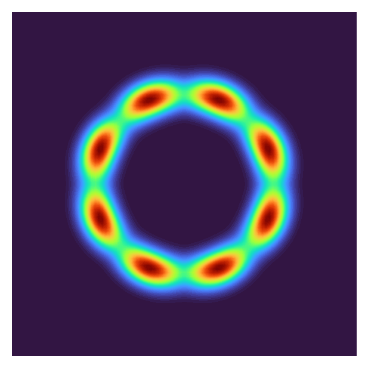
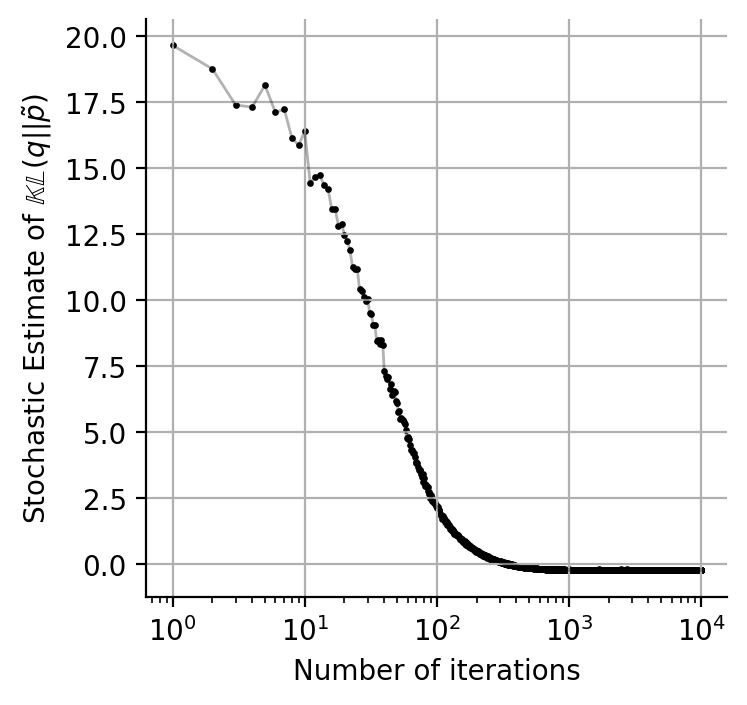

# Fitting mixtures of full-rank Gaussians using gradient

Below are two ways to use this repo.

## Example 1: density estimation given a dataset

## Example 2: variational inference given the log of an unnormalized density 

- 1st image: true (unnormalized) density
- 2nd image: learned (empirical) density with arrows showing the initial and final positions of Gaussian means
- 3rd image: learned mixture weights
- 4th image: learning curve

  
   
  
  

  
   
  
  

  
   
  
  

  
   
  
  

  
   
  
  

