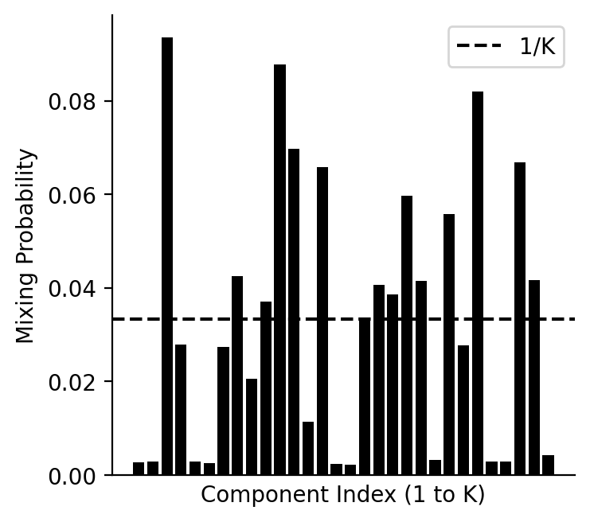

# Fitting mixtures of full-rank Gaussians using gradient

Below are two ways to use this repo.

## Example 1: density estimation given a dataset

Legend:
- 1st image: true (empirical) density (from data)
- 2nd image: learned (empirical) density
- 3rd image: learning curve

  
   
  

## Example 2: variational inference given the log of an unnormalized density 

Legend:

- 1st image: true (unnormalized) density
- 2nd image: learned (empirical) density with arrows showing the initial and final positions of Gaussian means
- 3rd image: learned mixture weights
- 4th image: learning curve

### Potential function U2

  
   
  
  

### Potential function U3

  
   
  
  

### Potential function U3

  
   
  
  

### Potential function U4

  
   
  
  

### Potential function U8

  
   
  
  

